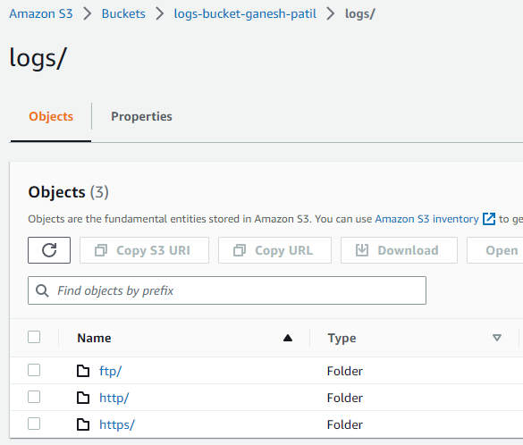
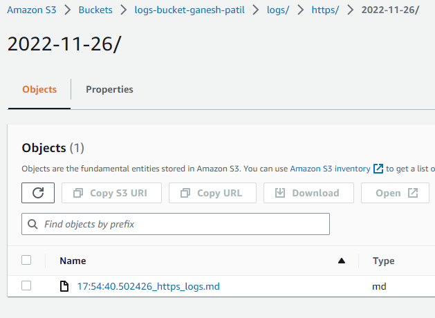

### Assignment 2 Solution:

###### Maintainer: Ganesh Patil

### 1. Environment:
- Program Created using Python- 3.10
- Install the dependencies from **requirements.txt** using below command:
    ````
    $ pip install -r requirements.txt
    ````

- Configure AWS using either of the below:
  - Configure AWS CLI **(Recommended)**:
    ````
    $ aws configure
    AWS Access Key ID [None]: <Your Access Key ID>
    AWS Secret Access Key [None]: <Your Secret Access Key>
    Default region name [None]: <Region>
    Default output format [None]: <json preffered>
    ````
  - Configure AWS Credentials inside code **(Not Recommended)**:
    ````
    # Approach 1: (Not Safe at All)
    s3_client = boto3.resource(
        's3',
        aws_access_key_id='<Your Access Key ID>',
        aws_secret_access_key='<Your Secret Access Key>'
    )
    
    # Approach 2: Need to export credentials as ENV variabels (Safer than Approach 1)
    s3_client = boto3.resource(
        's3',
        aws_access_key_id=os.environ['<Your Access Key ID>'],
        aws_secret_access_key=os.environ['<Your Secret Access Key>']
    )
    ````

--------

### 2. Execution:
For executing the program run below command:
````
$ python main.py
````
- Execution sequence:
  1. Fetch the list of valid log filenames from project-folder/logs directory (pattern- log*.md)
  2. Read input log file one by one
  3. Write logs to respective log files e.g. (https to https_log.md, ftp to ftp_log.md)
  4. Upload files to S3 bucket in respective folders

- Sample execution 1 (for 1 input log file):
  ````
  $ python main.py
  Uploading https_logs.md file to S3...
  Uploading http_logs.md file to S3...
  Uploading ftp_logs.md file to S3...
  ````

- Sample execution 2 (for 3 input log files):
  ````
  $ python main.py
  Uploading https_logs.md file to S3...
  Uploading http_logs.md file to S3...
  Uploading ftp_logs.md file to S3...
  Uploading https_logs.md file to S3...
  Uploading http_logs.md file to S3...
  Uploading ftp_logs.md file to S3...
  Uploading https_logs.md file to S3...
  Uploading http_logs.md file to S3...
  Uploading ftp_logs.md file to S3...
  ````
  
--------

### 3. Testcases:
Run below command for running test cases: 
````
$ python -m unittest discover
````

--------
### 4. S3 Bucket Folder Structure:
- 
- 
- 

#### Note: Please do not delete mock_data folder